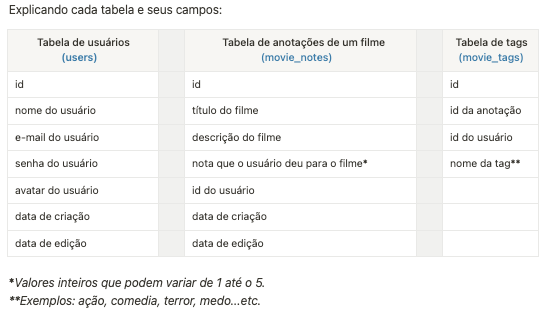

<h1 align="center"> APLICAÇÃO NODE.JS   (CADASTRO DE FILME) </h1>

Desenvolvido por Ivan Barbosa. 
Layout UI/UX RocketSeat.

  <a href="#-tecnologias">Tecnologias</a>&nbsp;&nbsp;&nbsp;|&nbsp;&nbsp;&nbsp;
  <a href="#-projeto">Projeto</a>&nbsp;&nbsp;&nbsp;|&nbsp;&nbsp;&nbsp;
  <a href="#-layout">Layout</a>&nbsp;&nbsp;&nbsp;|&nbsp;&nbsp;&nbsp;
  <a href="#memo-licença">Licença</a>

  
  

 

## 💻 Projeto

CRIAÇAO DE TABELAS 
A ideia foi criar uma aplicação em Node.js onde o usuário cadastra um filme, preenche com algumas informações (nome, descrição, nota) e cria tags relacionadas a ele.
Acima, temos um diagrama que foi usado como base:

## 🚀 Tecnologias

Esse projeto foi desenvolvido com as seguintes tecnologias:

- NODE.JS
- SQLITE
- KNEX
- JAVASCRIPT
- MIGRATIONS

## :memo: Licença

Esse projeto está sob a licença MIT.

---
